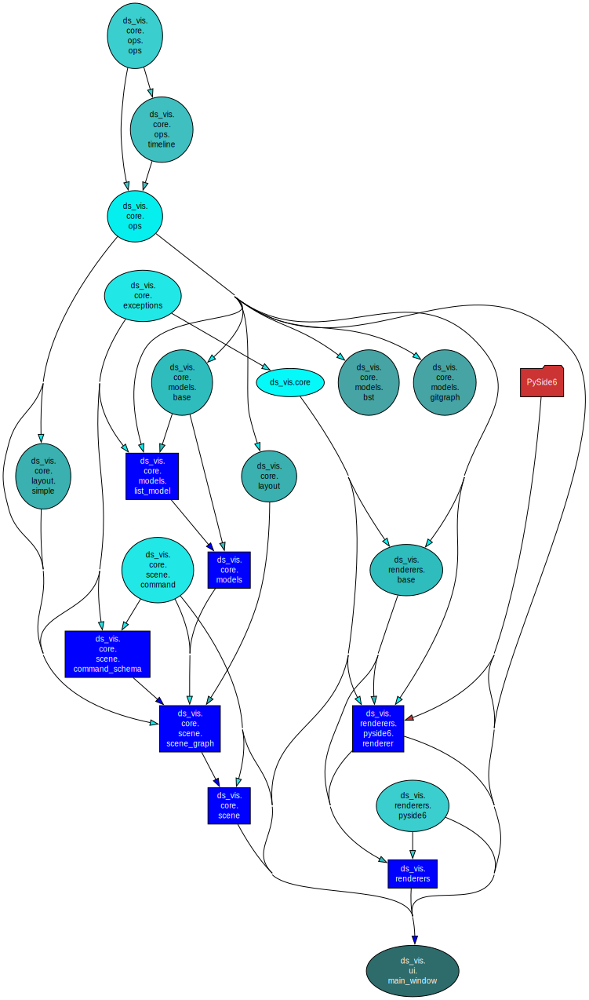
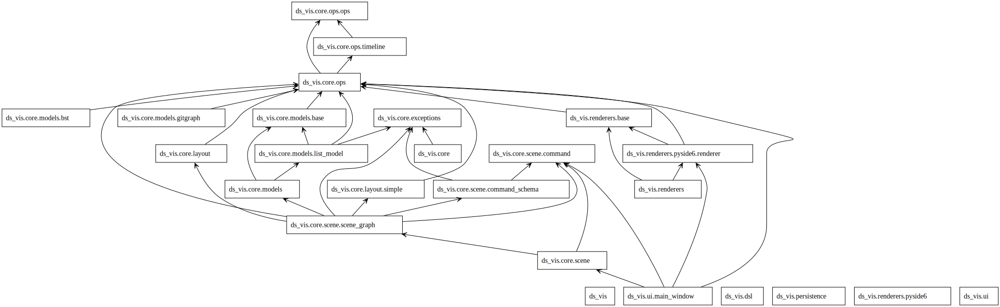
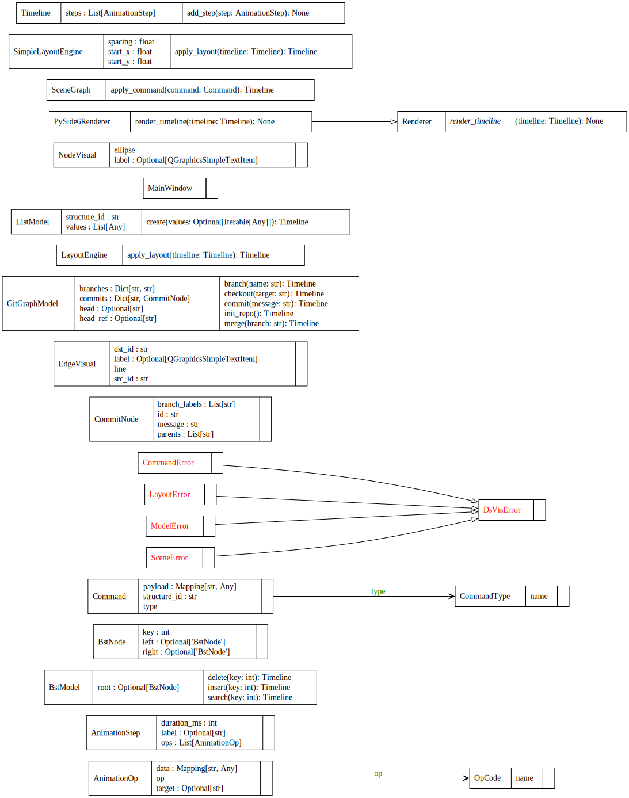
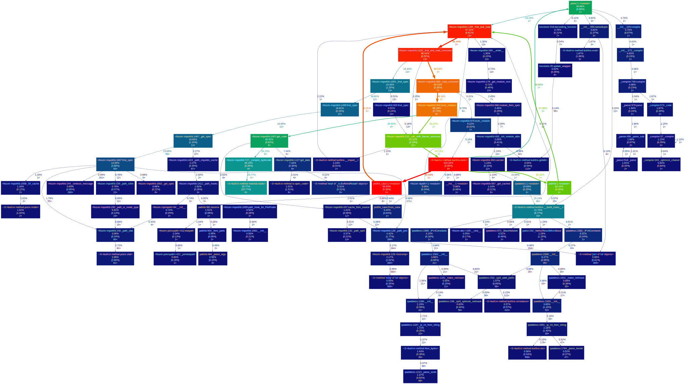

# Diagrams

## Immport Dependency Graph

下图是 *pydeps* 从源码自动生成, 展示模块间的import依赖关系(max-bacon=2),
可以检查架构层级间的依赖设计.

执行的命令为:
```bash
uv run pydeps src/ds_vis \
 --noshow \
 --max-bacon=2 \
 --cluster \
 -T svg \
 -o docs/diagrams/imports.svg
```



> 使用`scripts/arch_graph.py`生成的效果. (outdated)


## UML (pyreverse)

下图是 *pyreverse*(from *pylint*) 从源码自动生成，展示UML图

执行的指令为：
```bash
uv run pyreverse -o dot -p ds_vis src/ds_vis -d docs/diagrams/uml
dot -Grankdir=LR -Tsvg docs/diagrams/uml/classes_ds_vis.dot -o docs/diagrams/uml/classes_ds_vis.svg
# 正常版本的UML
dot -Tsvg docs/diagrams/uml/classes_ds_vis.dot -o docs/diagrams/uml/classes_ds_vis.td.svg
dot -Tsvg docs/diagrams/uml/packages_ds_vis.dot -o docs/diagrams/uml/packages_ds_vis.svg
```

### Packages


### Classes



## Runtime Call Graph

该图由 cProfile + gprof2dot + graphviz 从一次“最小案例运行”自动生成，
用于提供运行时证据（执行路径与热点）。

执行指令：
```bash
uv run python -m cProfile -o docs/diagrams/profile/case.pstats tools/profile_case.py
uv run gprof2dot -f pstats docs/diagrams/profile/case.pstats > docs/diagrams/profile/case.dot
dot -Tsvg docs/diagrams/profile/case.dot -o docs/diagrams/profile/callgraph.svg
```


