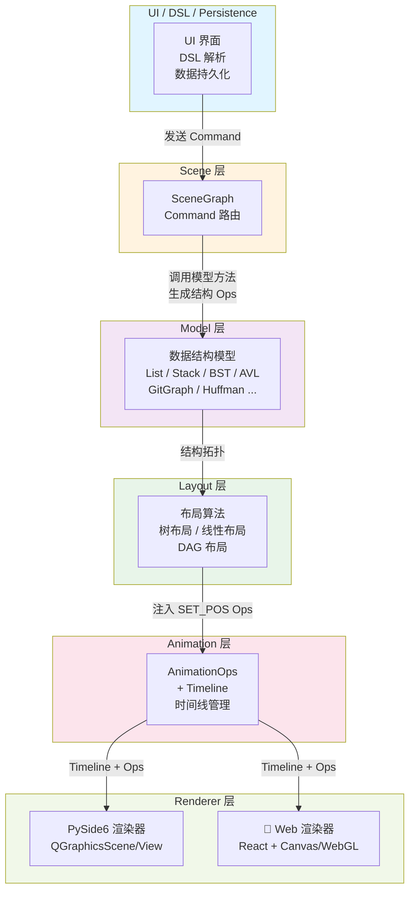

# QUICKSTART — 快速开始指南

## 1. 项目架构概览

本项目采用分层架构设计，从上到下分别为：UI 层、场景管理层、模型层、布局层、动画引擎和渲染器。



**核心特点：**

- ✅ **分层清晰**：每层职责明确，单向依赖
- ✅ **模型独立**：数据结构模型与 UI/Renderer 完全解耦
- ✅ **动画解耦**：通过 AnimationOps 和 Timeline 统一描述动画
- ✅ **多渲染器**：支持 PySide6（当前）和未来的 Web 渲染

---

## 2. 环境配置与依赖安装

### 2.1 前置要求

- Python 3.11+
- `uv` 包管理工具（[安装指南](https://github.com/astral-sh/uv)）

### 2.2 安装步骤

```bash
# 1. 进入项目根目录
cd /path/to/ds-vis

# 2. 安装依赖（创建虚拟环境）
uv sync

# 3. 验证安装
uv run python --version  # 应输出 Python 3.11+
```

详细环境配置见 [`docs/engineering/environment.md`](./engineering/environment.md)。

---

## 3. 核心概念

### 3.1 Command（命令）

用户界面或 DSL 通过 `Command` 与 SceneGraph 交互。

**示例：**
```python
# 在 BST 中插入值 5
cmd = Command(
    type="INSERT",
    structure_id="bst_1",
    payload={"value": 5}
)
```

### 3.2 AnimationOps 与 Timeline（动画指令）

Model 执行操作后生成一系列 **AnimationOps**，由 **Timeline** 组织播放。

**主要 Ops 类型：**

| Op 类型 | 说明 | 示例 |
|---------|------|------|
| `CREATE_NODE` | 创建节点 | `CREATE_NODE(id="n1", label="5")` |
| `DELETE_NODE` | 删除节点 | `DELETE_NODE(id="n1")` |
| `SET_POS` | 设置位置 | `SET_POS(id="n1", x=100, y=200)` |
| `SET_STATE` | 设置状态 | `SET_STATE(id="n1", state="highlight")` |
| `CREATE_EDGE` | 创建边 | `CREATE_EDGE(id="e1", from="n1", to="n2")` |

详细规范见 [`docs/design/ops_spec.md`](./design/ops_spec.md)。

---

## 4. 运行与测试

### 4.1 运行应用

```bash
# 启动桌面应用（PySide6）
uv run python -m ds_vis.ui.main_window
```

### 4.2 运行测试

```bash
# 运行所有测试
uv run pytest

# 运行特定文件的测试
uv run pytest tests/test_skeleton_flow.py -v

# 运行代码检查与类型检查
uv run ruff check src tests    # Linting
uv run mypy src                # 类型检查（可选）
```

---

## 5. 典型开发流程

根据你要实现的功能，遵循不同的开发流程：

### 5.1 实现数据结构模型

**目标：** 实现一个新的数据结构（如 AVL 树）

1. 在 `src/ds_vis/core/models/` 中创建模型类
2. 实现数据结构逻辑，生成 AnimationOps Timeline
3. 编写单元测试 `tests/test_avl.py`
4. 运行 `uv run pytest tests/test_avl.py` 验证

**示例：** 见 [`src/ds_vis/core/models/bst.py`](../src/ds_vis/core/models/bst.py)

### 5.2 实现布局算法

**目标：** 为数据结构计算节点坐标

1. 在 `src/ds_vis/core/layout/` 中实现布局算法
2. 接收 Ops 流和拓扑信息，注入 SET_POS Ops
3. 编写布局测试 `tests/test_layout_*.py`
4. 运行验证

**约束：** 布局层不应依赖数据结构的业务逻辑，仅基于拓扑结构计算坐标

详见 [`docs/design/architecture.md`](./design/architecture.md#6-layout-层)

### 5.3 实现 Renderer

**目标：** 将 Ops 和 Timeline 渲染成可视化动画

1. 继承 `src/ds_vis/renderers/base.py` 中的 `Renderer` 抽象类
2. 实现 `render(timeline: Timeline)` 方法
3. 编写渲染测试 `tests/test_renderer_*.py`
4. 运行验证

**示例：** 见 [`src/ds_vis/renderers/pyside6/renderer.py`](../src/ds_vis/renderers/pyside6/renderer.py)

### 5.4 实现 UI 功能

**目标：** 添加用户界面，连接 Command 与 SceneGraph

1. 在 `src/ds_vis/ui/` 中实现 UI 组件
2. 捕获用户交互（点击、输入等）生成 Command
3. 通过 SceneGraph 执行 Command，获取 Timeline
4. 将 Timeline 送给 Renderer 播放

详见 [`docs/design/architecture.md`](./design/architecture.md#3-scenegraph-与-command)

---

## 6. 文件导航

| 文件/目录 | 说明 |
|----------|------|
| `docs/design/requirements.md` | 需求与用例说明 |
| `docs/design/architecture.md` | 详细架构与分层设计 |
| `docs/design/animation.md` | 动画微步骤设计 |
| `docs/design/ops_spec.md` | AnimationOps 类型与规范 |
| `docs/engineering/environment.md` | 环境配置与命令 |
| `docs/engineering/dev_kb.md` | 开发常见问题与最佳实践 |
| `AGENTS.md` | Agents 权限与工作流 |
| `src/ds_vis/core/` | 核心引擎（模型、布局、Ops、SceneGraph） |
| `src/ds_vis/renderers/` | 渲染器实现 |
| `src/ds_vis/ui/` | UI 界面 |
| `tests/` | 单元测试 |

---

## 7. 常见问题

**Q: 我想添加一个新的数据结构，应该从哪里开始？**

A: 从 `src/ds_vis/core/models/` 开始实现模型，生成 AnimationOps，无需关心 UI 或 Renderer。详见 Section 5.1

**Q: Model 层可以导入 Renderer 吗？**

A: 不可以。这违反了架构规则。所有交互必须通过 SceneGraph 和 Command 进行。详见 [`AGENTS.md`](../AGENTS.md#3-架构红线必须遵守)

**Q: 如何调试 Timeline 生成？**

A: 在 `tests/` 中编写单元测试，直接调用 Model 方法并检查返回的 Timeline 对象。详见 `docs/engineering/dev_kb.md`

---

## 8. 下一步

- 阅读 [`docs/design/architecture.md`](./design/architecture.md) 了解详细的分层设计
- 查看 [`AGENTS.md`](../AGENTS.md) 了解开发权限与工作流
- 选择一个任务开始贡献：实现模型 / 布局 / Renderer 之一
